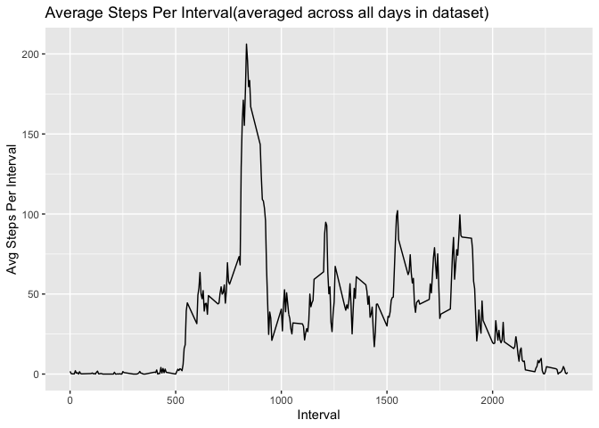

## Loading and preprocessing the data

First load all the required packages used in the analysis.

```r
library(tidyverse)
```

Unzip the activity data archive file, download if it not present in the root directory of project. Load extracted activity.csv file into a tibble.

```r
if(!file.exists("activity.zip")){
  activity_data_zip_url <- "https://d396qusza40orc.cloudfront.net/repdata%2Fdata%2Factivity.zip"
  download.file(url = activity_data_zip_url, destfile = "activity.zip")
}
unzip("activity.zip")
activity <- read_csv("activity.csv", show_col_types = FALSE)
```


## What is mean total number of steps taken per day?

```r
total_steps_day <- activity %>% group_by(date) %>% summarise(steps = sum(steps, na.rm = TRUE))
qplot(steps, data = total_steps_day, binwidth = 5000, main = "Histogram of Total Steps Per Day")
```

<!-- -->

```r
mean_steps <- mean(total_steps_day$steps, na.rm = TRUE)
median_steps <- median(total_steps_day$steps, na.rm = TRUE)
```

**The mean of the total steps taken per day is *9354.23* and the median of the total steps taken per day is *10395***.


## What is the average daily activity pattern?

```r
avg_steps_interval <- activity %>% group_by(interval) %>% summarise(mean_steps = mean(steps, na.rm=TRUE))
qplot(interval, mean_steps, data = avg_steps_interval, geom = "line") + labs( x = "Interval", y = "Avg Steps Per Interval", title =  "Average Steps Per Interval(averaged across all days in dataset)")
```

<!-- -->

```r
interval_max_mean_steps <- avg_steps_interval[avg_steps_interval$mean_steps == max(avg_steps_interval$mean_steps),1]
```

**The interval with maximum number of average steps, averaged across all days in the dataset, is *835***.

## Imputing missing values
**There are *2304* rows with missing values in the activity dataset.**

**We will use the mean steps taken in that interval, averaged across the days in the datset, to fill in missing values for that interval.**

```r
activity_imputed <- activity %>% left_join(avg_steps_interval, by="interval") %>% mutate(steps = ifelse(is.na(steps),mean_steps,steps)) %>% select(steps, date, interval)

total_steps_day_imputed <- activity_imputed %>% group_by(date) %>% summarise(steps = sum(steps))
qplot(steps, data = total_steps_day_imputed, binwidth = 5000, main = "Histogram of Total Steps Per Day (Imputed Data)")
```

<!-- -->

```r
mean_steps_imputed <- mean(total_steps_day_imputed$steps)
median_steps_imputed <- median(total_steps_day_imputed$steps)
```

**With missing steps imputed with the mean steps of that particular interval of the day, the mean of the total steps taken per day is *10766.19* and the median of the total steps taken per day is *10766.19***.

## Are there differences in activity patterns between weekdays and weekends?

```r
activity_imputed <- activity_imputed %>% mutate(weekday = ifelse(weekdays(date) %in% c("Saturday","Sunday"), "Weekend", "Weekday"))

avg_steps_interval_imputed <- activity_imputed %>% group_by(interval,weekday) %>% summarise(mean_steps = mean(steps), .groups = 'drop')

ggplot(data = avg_steps_interval_imputed, aes(x=interval, y=mean_steps)) + geom_line() +facet_grid(rows = vars(weekday)) + labs( x = "Interval", y = "Avg Steps Per Interval", title =  "Average Steps Per Interval(averaged across all days in dataset)")
```

<!-- -->

**Yes, there are differences in the activity patterns between weekdays and weekends. On weekdays, there is only one peak interval of activity, where as on weekends, there are more peaks of activity spread out at different intervals throughout the day.**
